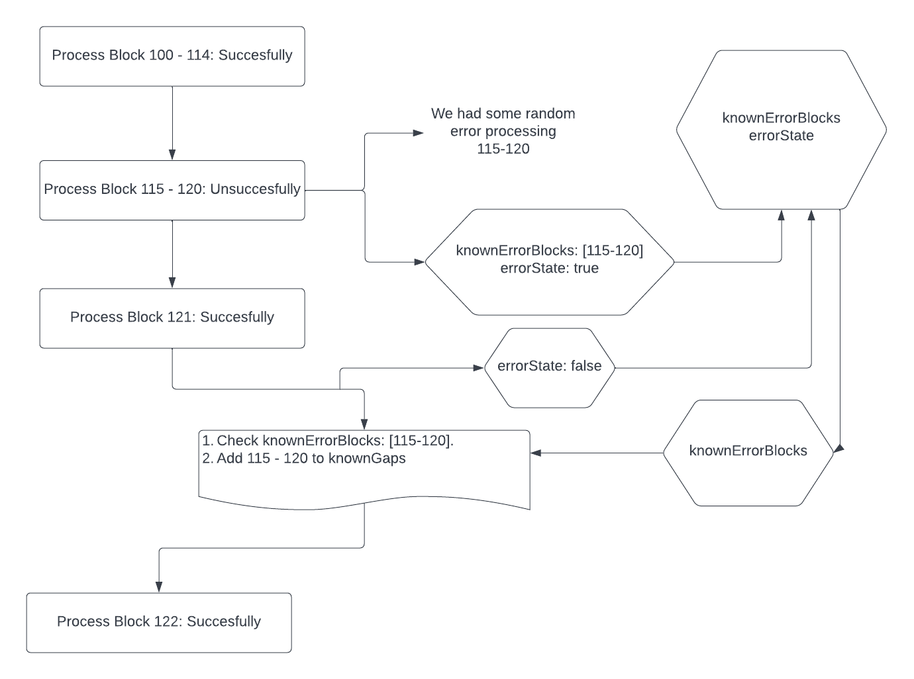

# Overview

This document will provide some insight into the `known_gaps` table, their use cases, and implementation. Please refer to the [following PR](https://github.com/vulcanize/go-ethereum/pull/217) and the [following epic](https://github.com/vulcanize/ops/issues/143) to grasp their inception.

# Use Cases

The known gaps table is updated when the following events occur:

1. At start up we check the latest block from the `eth.headers_cid` table. We compare the first block that we are processing with the latest block from the DB. If they are not one unit of expectedDifference away from each other, add the gap between the two blocks.
2. If there is any error in processing a block (db connection, deadlock, etc), add that block to the knownErrorBlocks slice, when the next block is successfully written, write this slice into the DB.

# Glossary

1. `expectedDifference (number)` - This number indicates what the difference between two blocks should be. If we are capturing all events on a geth node then this number would be `1`. But once we scale nodes, the `expectedDifference` might be `2` or greater.
2. `processingKey (number)` - This number can be used to keep track of different geth nodes and their specific `expectedDifference`.
